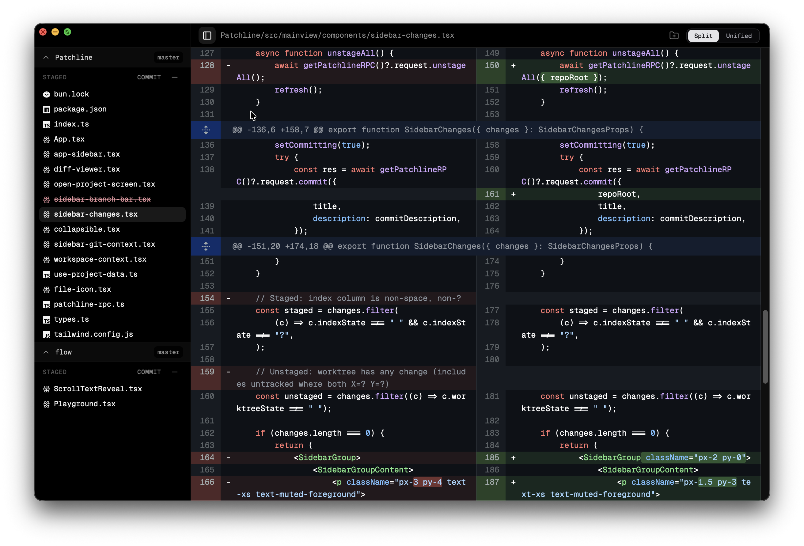
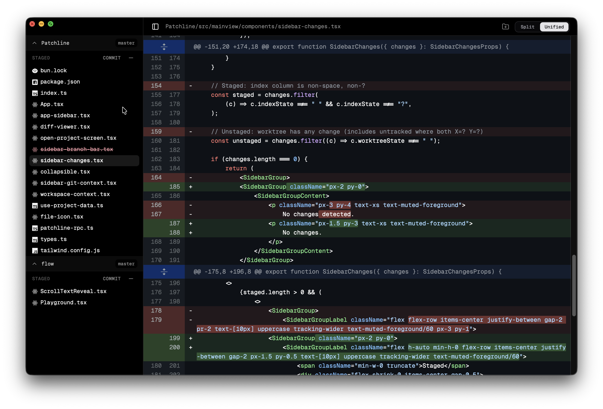
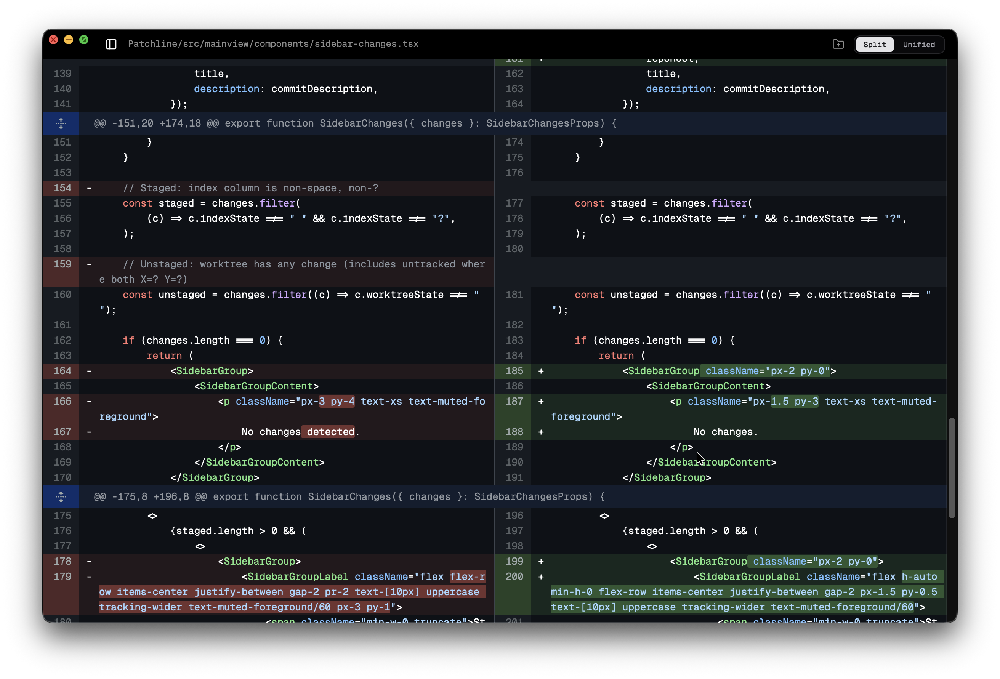
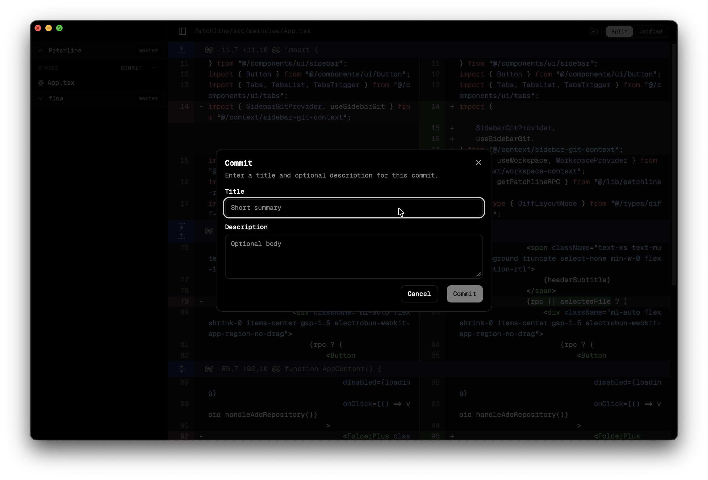

<div align="center">

# Patchline

### _Patches, line diffs, and commits — a lightweight window built for reading source changes._

[](https://bun.sh)
[](https://react.dev)
[](https://blackboard.sh/electrobun/)
[](https://www.typescriptlang.org)
[](https://tailwindcss.com)

<br />

**Native window · Local-first · Git at the speed of Bun**

[The problem](#the-problem) · [Scope](#scope) · [Supported](#supported-today) · [Incoming](#incoming--not-yet) · [Quick start](#quick-start) · [Screenshots](#screenshots) · [Development](#development) · [Build](#production-build) · [Layout](#repository-layout)

</div>

---

<br />

## The problem

Day-to-day coding often splits across **agents** (e.g. Claude Code) and **editors** (e.g. Cursor). Agent UIs are great for iteration, but **built-in diffs are usually not** — hard to scan, easy to miss hunks, and not where you want to live when you’re **reviewing** changes carefully.

**Patchline** exists because **review deserves its own surface**: a **small, fast, native window** whose only job is to show **what changed** (patch by patch, line by line), let you **stage** and **commit** with confidence, and stay out of the way of your IDE.

If you want a **quick, lightweight code diff** tool — not another full Git GUI — this is it.

---

## Scope

|                      |                                                                                                            |
| :------------------- | :--------------------------------------------------------------------------------------------------------- |
| **Multiple repos**   | Track **several Git repositories** in one window — seed with **repeated `--source`**, **`PATCHLINE_SOURCE=a,b`**, **Open project** / **Choose folders…** (multi-select where the OS allows), or **Add repository** (folder icon in the header). |
| **No worktrees yet** | [Git worktrees](https://git-scm.com/docs/git-worktree) are **not** supported; use a normal clone checkout. |

---

## Supported today

| Area           | What works                                                                                                                |
| -------------- | ------------------------------------------------------------------------------------------------------------------------- |
| **Repositories** | **Multi-repo:** each root has its own **Staged** / **Changes**, **branch** in the sidebar, and **collapsible** section. Seed repos at launch with **repeated `--source`** or **`PATCHLINE_SOURCE=/a,/b`** (comma-separated); **Choose folders…** can add **multiple** valid `.git` directories in one sheet; **Add repository** appends more without restart. |
| **Changes**    | Per-repo lists from `git status --porcelain` — **staged** vs **unstaged** buckets                                                                    |
| **Diffs**      | Per-file diff (scoped to the correct repo) with **unified** or **split** layout ([`@git-diff-view`](https://github.com/MrWangJustToSay/git-diff-view)); title bar shows `repoFolder/path/in/repo` |
| **Staging**    | Stage / unstage one file; **stage all** / **unstage all** **per repository**                                                                 |
| **Commit**     | **Title + description** (subject + body) **per repo**, then refresh                                                                    |
| **Branch**     | Current branch (and **upstream** `@{u}`) **per repo** in each sidebar header                                                                                  |
| **Platform**   | macOS-oriented Electrobun app; dev + canary build pipeline                                                                |

---

## Incoming / not yet

|                        |                                                                        |
| :--------------------- | :--------------------------------------------------------------------- |
| **Git worktrees**      | Open and switch [worktrees](https://git-scm.com/docs/git-worktree) in the app (today: use a normal clone checkout; see **Scope**) |
| **Merge conflicts**    | Resolve conflicts here — navigate markers, pick hunks or ours/theirs, finish merge/rebase without leaving Patchline |
| **Broader Git**        | Push, pull, merge, rebase, branches UI, remote management, etc.        |
| **File tree / editor** | Full repo browser and in-app editing were intentionally trimmed for v1 |

_Roadmap is informal — PRs welcome for the gaps you care about._

---

## Why Patchline? (technical)

|                  |                                                                                                                                                   |
| :--------------- | :------------------------------------------------------------------------------------------------------------------------------------------------ |
| **Main process** | [Bun](https://bun.sh) + [Electrobun](https://blackboard.sh/electrobun/) — native window, Git via [simple-git](https://github.com/steveukx/git-js) |
| **UI**           | [React](https://react.dev) + [Tailwind CSS](https://tailwindcss.com) + shadcn-style components                                                    |
| **Dev UX**       | [Vite](https://vitejs.dev) HMR for instant UI feedback while you iterate                                                                          |

---

## Quick start

**Prerequisites:** [Bun](https://bun.sh) install.

```bash
git clone <repo-url>
cd patchline
bun install
```

### Opening a repository

**Verified behavior (dev and production builds):** if `PATCHLINE_SOURCE` is set when the process starts, each listed Git root is added (see **multiple repos** below). If you have **no** repos yet, you get **Add a repository** and a native **Choose folders…** sheet (each selection must be a directory containing `.git`; you can pick **multiple** folders in one go where the OS dialog allows). After the first repo(s), use the **folder-plus** control in the **top bar** to add more anytime.

**Option A — `--source` flags (recommended)**  
Repeat **`--source`** once per repository (paths are resolved from the current working directory). With **npm**, pass them after `--` so they reach the launcher:

```bash
cd /path/to/patchline
npm run patchline:hmr -- --source .
# two repos:
npm run patchline:hmr -- --source . --source ../other-repo
```

Same idea with **Bun** directly:

```bash
bun patchline.ts --hmr --source "$PWD" --source ~/work/my-app
```

You can still put **comma-separated** paths in a single flag: `--source .,../other-repo`. **`--source=/path`** works too.

**Option B — environment variable**  
`PATCHLINE_SOURCE` is **comma-separated** absolute or relative roots (the launcher also writes this when you use `--source`). Handy for agents and scripts:

```bash
cd /path/to/patchline
export PATCHLINE_SOURCE="$PWD,/path/to/other-repo"
bun run patchline:hmr
```

**Option C — no env / no `--source`**  
From the clone root:

```bash
bun run patchline:hmr
# or: bun patchline.ts --hmr
```

The launcher [`patchline.ts`](./patchline.ts) sets `PATCHLINE_SOURCE` from your **`--source`** arguments; if you pass **none**, it **clears** inherited `PATCHLINE_SOURCE` in the child process so you don’t accidentally open the wrong tree.

### Claude Code (and other agents)

Point Patchline at the **same** working tree the agent uses, then use Patchline for diffs, staging, and commits:

```bash
cd /path/to/patchline   # or whatever project the agent is editing
export PATCHLINE_SOURCE="$PWD"
bun run patchline:hmr
```

---

## Screenshots

Assets live in [`screenshots/`](./screenshots/).

**Sidebar — multiple repos** (collapsible sections, **Staged** / **Changes** per repo)



**Unified diff**



**Split diff**



**Commit dialog**



---

## Development

| Command                 | What it does                                                               |
| ----------------------- | -------------------------------------------------------------------------- |
| `bun run patchline:hmr` | **Recommended** — Vite on `:5173` + Electrobun; hot reload for the webview |
| `bun run dev`           | Electrobun only (expects built assets; run `vite build` first if needed)   |

---

## Production build

```bash
bun run build
```

Runs **Vite production** (`dist/`) then **Electrobun** (`--env=canary`). The `.app` uses the same Bun main as dev (`src/bun/index.ts`). Outputs depend on your OS/arch:

| Output          | Typical location                                                                                             |
| --------------- | ------------------------------------------------------------------------------------------------------------ |
| **.app bundle** | `build/canary-macos-arm64/Patchline-canary.app` (folder name may include `linux` / `win` on other platforms) |
| **Installer**   | `artifacts/canary-macos-arm64-Patchline-canary.dmg` (+ `.tar.zst` update payload)                            |

**Run the built macOS app**

| How you open it | What happens |
| :-- | :-- |
| **Double-click** the `.app`, or `open Patchline-canary.app` | No env → **Choose folders…** / **Add repository** in the UI (same idea as dev with no `--source`). |
| **`open --env PATCHLINE_SOURCE="…"`** | **One env var**, one string. Split repo roots with **commas** (no spaces). Prefer **absolute** paths. |

**Example (verified):** two repos at launch —

```bash
open --env PATCHLINE_SOURCE="/Users/kannan/Projects/Patchline,/Users/kannan/Projects/flow" \
  "/Users/kannan/Projects/Patchline/build/canary-macos-arm64/Patchline-canary.app"
```

One repo is the same, without a comma:

```bash
open --env PATCHLINE_SOURCE="/Users/kannan/Projects/Patchline" \
  "/Users/kannan/Projects/Patchline/build/canary-macos-arm64/Patchline-canary.app"
```

**`open -n`** starts a **new** app instance. Use it if Patchline is already running and you need this launch to pick up **`PATCHLINE_SOURCE`** (otherwise macOS may reuse the old process and ignore the new env):

```bash
open -n --env PATCHLINE_SOURCE="/path/repo-a,/path/repo-b" "/path/to/Patchline-canary.app"
```

**How this relates to dev:** the Bun main always reads **`PATCHLINE_SOURCE`** and splits on **`,`**. Dev **[`patchline.ts`](./patchline.ts)** can set that for you via repeated **`--source`** flags. The **`.app` does not take `--source`** — for production you only use **`open --env`** (or plain `open` with no env).

**macOS:** `VAR=value open …` often **does not** inject env into a GUI `.app`; use **`open --env`** as above.

**Tip:** `open -n /path/to/Patchline-canary.app` with **no** `--env` opens a fresh instance with no pre-seeded repos.

Install from the `.dmg` in `artifacts/` if you prefer; drag **Patchline** to Applications, then use Finder or the `open` / `open --env` patterns above.

> `bun run build:canary` is the same as `bun run build`.

---

## Repository layout

```
src/
├── bun/index.ts          # Main process: window, RPC, Git operations
├── mainview/             # React app (webview)
└── shared/types.ts       # Shared RPC contracts (main ↔ webview)
electrobun.config.ts      # App identity, bundle id, copy paths
vite.config.ts            # Vite bundle for mainview
patchline.ts              # Dev launcher (`--source` optional, `--hmr`)
screenshots/              # README gallery
```

| Customize            | Where                                  |
| -------------------- | -------------------------------------- |
| Window, Git, RPC     | `src/bun/index.ts`                     |
| UI & layout          | `src/mainview/`                        |
| App name & bundle id | `electrobun.config.ts`, `package.json` |

---

## Tech stack

```text
┌─────────────┐     RPC      ┌──────────────┐
│  Bun main   │ ◄──────────► │ React view   │
│  (Git, fs)  │   typed      │ (Vite + TW)  │
└─────────────┘              └──────────────┘
```

---

<div align="center">

<sub>Built with Electrobun — not Electron. See <a href="https://blackboard.sh/electrobun/docs/">Electrobun docs</a> for the platform model.</sub>

</div>
